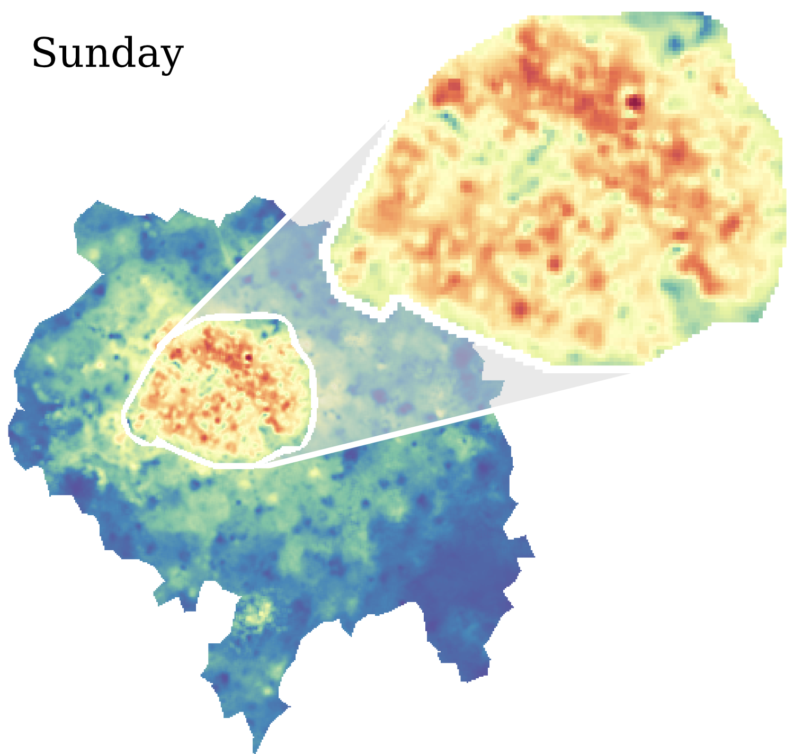

# Netmob 2023 Data Challenge

 

This repository contains code snippet on how to manipulate the data from the **Netmob 2023 Data Challenge**.

## Description

The full description of the dataset and the methodology can be found in our pre-print available here: [The NetMob23 Dataset: A High-resolution Multi-region Service-level Mobile Data Traffic Cartography](https://arxiv.org/abs/2305.06933).

 

## Data
To access the full data, you need first request access at [http://netmob2023challenge.networks.imdea.org/](http://netmob2023challenge.networks.imdea.org/).

## Code Snippet

 

The notebook [Regions.ipynb](Regions.ipynb) contains code snippet how to load the the geojson files and plot the regions. For a simple visualization, you can use the [geojson.io](https://geojson.io/) website.

 

The notebook [Traffic_map.ipynb](Traffic_map.ipynb) contains code snippet on how to load the traffic records from the txt files and plot the traffic map.

