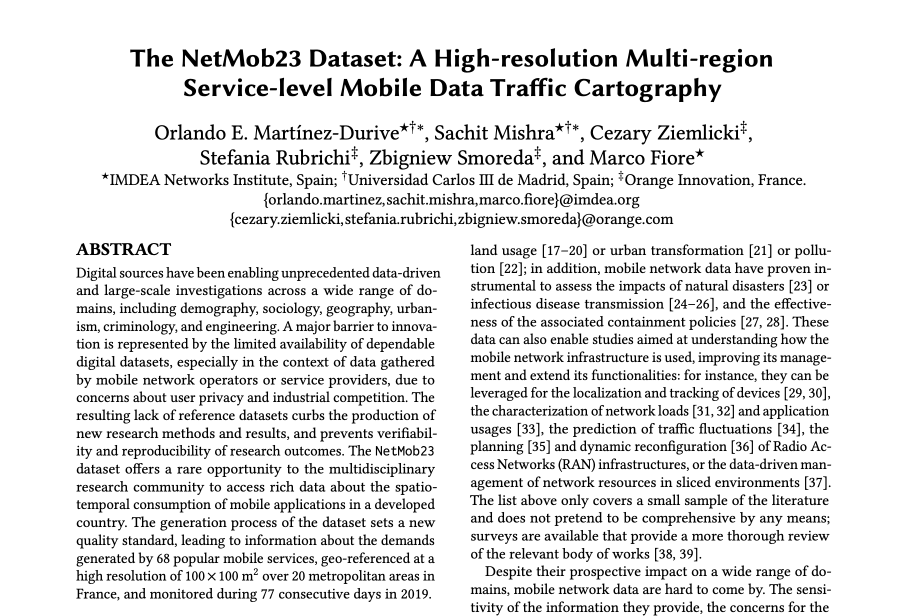
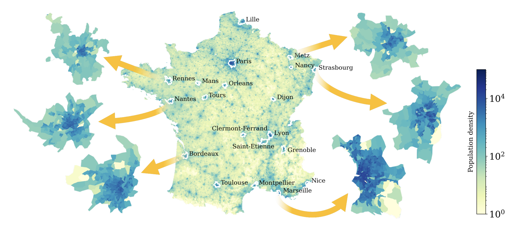
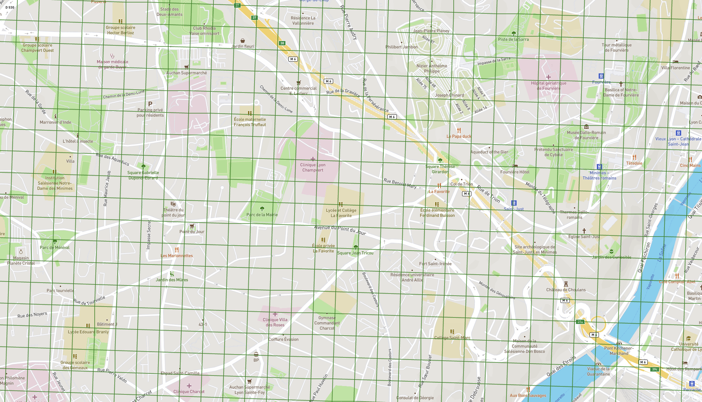
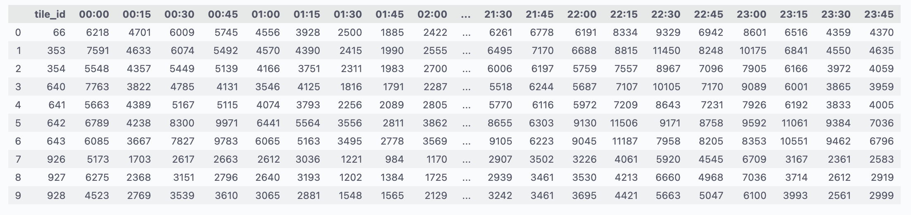
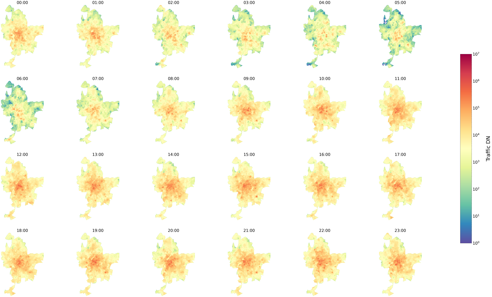
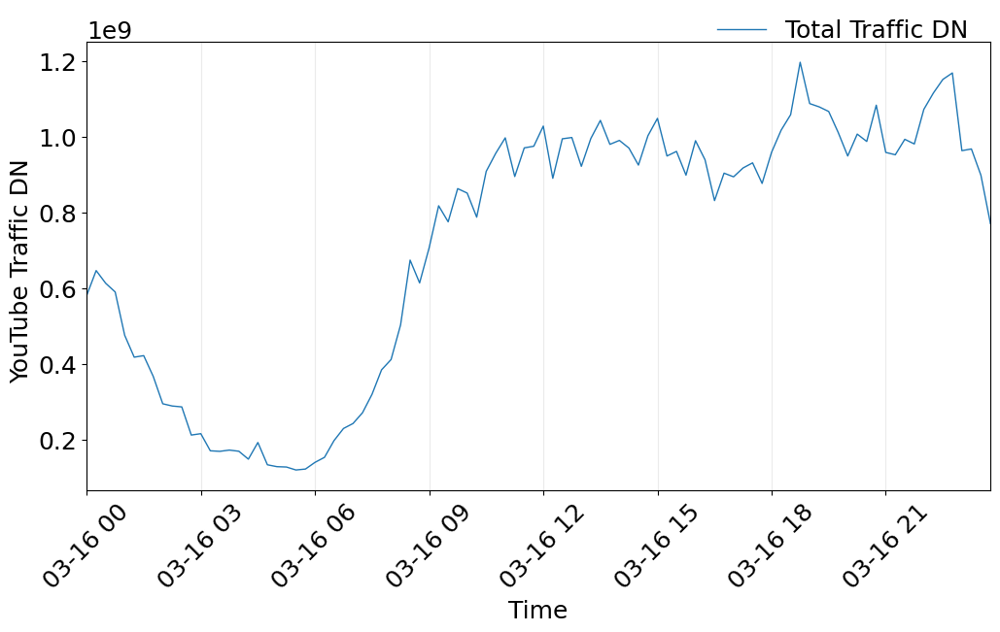

 

# Netmob 2023 Data Challenge


<!-- This repository contains information and code snippets on how to manipulate the data from the **Netmob 2023 Data Challenge**. -->

The full description of the dataset and the methodology can be found in our pre-print available here: [The NetMob23 Dataset: A High-resolution Multi-region Service-level Mobile Data Traffic Cartography](https://arxiv.org/abs/2305.06933).

 


Please cite our work, when using the dataset:

```bibtex
@misc{netmob23, title={The NetMob23 dataset: A high-resolution multi-region service-level mobile data traffic cartography}, author={Martínez-Durive, Orlando E and Mishra, Sachit and Ziemlicki, Cezary and Rubrichi, Stefania and Smoreda, Zbigniew and Fiore, Marco}, year={2023}, eprint={2305.06933}, archivePrefix={arXiv}, primaryClass={cs.NI} }
```

## Data access

The dataset is composed by:
* 20 urban areas in France
* 68 mobile services (including YouTube, Netflix, Facebook, Instagram, Gmail, etc.)
* 77 days continuous days
* 100 x 100 m2 spatial resolution
* 15 minute temporal resolution
* 400+ billion data points
* 2.3+ TB of data

The access to the full data is **restricted to the participants** of the [Netmob 2023 Data Challenge](http://netmob2023challenge.networks.imdea.org/) and to the [terms and conditions](https://netmob2023challenge.networks.imdea.org/terms-and-conditions/).


### Spatial dataset

 

The spatial dataset is composed of 20 France cities. Each one is represented by a geojson file, that contains the grid of the city composed of 100 x 100 m<sup>2</sup> tile. 
The tile (feature) is represented by a polygon using [WGS84](https://en.wikipedia.org/wiki/World_Geodetic_System). 

```json
{"type": "Feature",
 "geometry": {"type": "Polygon",
  "coordinates": [[
    [4.7662070878542515, 45.55631465259445],
    [4.766246657177647, 45.55721386239888],
    [4.767526651889026, 45.5571860567685],
    [4.767487061740877, 45.55628684742171],
    [4.7662070878542515, 45.55631465259445]
    ]]},
 "properties": {"tile_id": 66}}
 ```

The `tile_id` allows to represent the spatial information in a matrix form; where each tile is represented by a matrix element. 

$row\_index = floor(\frac{tile\_id}{cols}) $

$col\_index = tile\_id \mod cols$

The matrix dimension (rows, cols) are given in the `cities_dims` dictionary.

```json
cities_dims = {
    "Bordeaux": (334, 342), 
    "Clermont-Ferrand": (208, 268),
    "Dijon": (195, 234),
    "France": (9742, 9588),
    "Grenoble": (409, 251),
    "Lille": (330, 342),
    "Lyon": (426, 287),
    "Mans": (228, 246),
    "Marseille": (211, 210),
    "Metz": (226, 269),
    "Montpellier": (334, 327),
    "Nancy": (151, 165),
    "Nantes": (277, 425),
    "Nice": (150, 214),
    "Orleans": (282, 256),
    "Paris": (409, 346),
    "Rennes": (423, 370),
    "Rouen": (327, 373),
    "Saint-Etienne": (305, 501),
    "Strasbourg": (296, 258),
    "Toulouse": (280, 347),
    "Tours": (251, 270)
    }
```

The notebook [Regions.ipynb](Regions.ipynb) contains code snippet how to load the the geojson files and plot the regions. For a simple visualization, you can use the [geojson.io](https://geojson.io/) website.

<!--   -->

### Traffic dataset

The traffic dataset is composed of **209440** plain text files.
Each one for each combination of city, service, day and direction of the traffic. 
A given file, contains the traffic record for all the tiles of the city every 15 minutes.

 

The notebook [Traffic_map.ipynb](Traffic_map.ipynb) contains code snippet on how to load the traffic records from the txt files and plot traffic maps.

 

 

